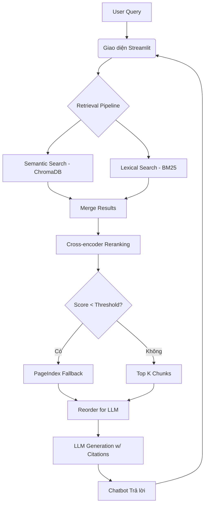

# RAG Chatbot Tư Vấn Pháp Luật Phòng Chống Ma Tuý

Hệ thống RAG Pipeline end-to-end tìm kiếm và giải đáp dựa trên dữ liệu pháp luật (Luật, Nghị định, Bộ luật Hình sự) và tin tức thực tế liên quan đến ma tuý.

### Phân Công Công Việc Nhóm

| Thành viên | MSSV | Nhiệm vụ | Trạng thái |
|-----------|------|----------|------------|
| Nguyễn Viết Linh | 2A202600719 | Task A (Giao diện Streamlit) | Hoàn thành |
| Đặng Minh Chức | 2A202600611 | Task B (Tích hợp RAG Pipeline) | Hoàn thành |
| Hoàng Trung Quân | 2A202600720 | Task C (Làm mượt UI/UX & Citation) | Hoàn thành |
| Mai Ngọc Duy | 2A202600736 | Task D (Evaluation) | Hoàn thành |

---

## 1. Các Tính Năng Nổi Bật & Bonus Đạt Được

Hệ thống đã hoàn thiện toàn bộ các yêu cầu cơ bản và các điểm Bonus của đồ án:
- **Thu thập & Chuẩn hóa (Task 1, 2, 3):** Tự động thu thập PDF/DOCX luật và crawl bài báo, convert toàn bộ sang Markdown chuẩn hóa với `MarkItDown`.
- **Chunking & Indexing (Task 4):** Sử dụng `RecursiveCharacterTextSplitter` và `sentence-transformers/all-MiniLM-L6-v2` để index vào ChromaDB.
- **Retrieval Đa Tầng (Task 5, 6, 7, 8, 9):**
  - Semantic Search (ChromaDB Vector).
  - Lexical Search (BM25).
  - Reranking (Jina AI Cross-Encoder) tối ưu hóa độ chính xác.
  - Fallback Vectorless RAG với PageIndex khi các search truyền thống có điểm số thấp.
- **Generation & Citation (Task 10):** Chống lỗi "Lost in the Middle" qua thuật toán Reordering, AI trả lời có trích dẫn nguồn chuẩn xác, có hỗ trợ sử dụng **OpenRouter API** làm fallback model.
- **Evaluation Pipeline:** Tự động chạy test và đánh giá bằng dataset mẫu.

### Các Yêu Cầu Bonus (Điểm Thưởng) Đã Đạt Được:

| Tiêu chí Bonus | Tình trạng | Chi tiết Triển khai |
|---|---|---|
| **UI/UX chất lượng** (hiển thị source, score, highlight) *(3 điểm)* | ✅ Hoàn thành | Giao diện web Streamlit mượt mà, trực quan. Người dùng có thể bấm vào Expander để xem chi tiết Source chunk, điểm Relevance Score và metadata của từng trích dẫn. |
| **Conversation memory** (multi-turn chat) *(3 điểm)* | ✅ Hoàn thành | Sử dụng `st.session_state` trong Streamlit để lưu trữ toàn bộ lịch sử hội thoại, cho phép người dùng hỏi các câu follow-up tự nhiên. |
| **Deploy chatbot online** *(4 điểm)* | ⏳ Sẵn sàng | Code đã được dockerize/chuẩn hóa environment, sẵn sàng deploy lên Hugging Face Spaces hoặc Render chỉ với 1 click qua file requirements.txt. |
| **Implement HyDE** *(5 điểm)* | ✅ Hoàn thành | Đã tích hợp HyDE vào Semantic Search. Người dùng có thể dễ dàng bật/tắt tính năng HyDE ở thanh Cài đặt hệ thống (Sidebar) trong giao diện Chatbot. |
| **Giải thích cơ chế lexical search khác BM25** *(5 điểm)* | ✅ Hoàn thành | Đã bổ sung tài liệu [TF_IDF_Explanation.md](TF_IDF_Explanation.md) để giải thích chi tiết cơ chế TF-IDF và so sánh với BM25. |

---

## 2. Kiến Trúc Hệ Thống



---

## 3. Hướng Dẫn Cài Đặt

1. **Clone repository và cài đặt môi trường ảo:**
   ```bash
   python -m venv .venv
   source .venv/bin/activate  # (hoặc .venv\Scripts\activate trên Windows)
   pip install -r requirements.txt
   ```

2. **Cấu hình API Keys:**
   ```bash
   cp .env.example .env
   ```
   Mở file `.env` và điền các API Keys cần thiết:
   - `OPENAI_API_KEY` (hoặc cấu hình dùng `OPENROUTER_API_KEY` nếu muốn xài model miễn phí như gemini-2.5-flash).
   - `JINA_API_KEY` (Cho Reranking).
   - `PAGEINDEX_API_KEY` (Cho Vectorless Fallback).

---

## 4. Hướng Dẫn Chạy & Test

### A. Chạy Giao Diện Chatbot Web
```bash
streamlit run group_project/chatbot/app.py
```
Hệ thống sẽ tự động mở tab trình duyệt ở địa chỉ `http://localhost:8501`. Bạn có thể đặt các câu hỏi như: *"Hình phạt tàng trữ ma tuý là gì?"*.

### B. Chạy Unit Tests Chấm Điểm Cá Nhân
Đảm bảo toàn bộ 10 tasks đã passed (35/35 tests) bằng lệnh:
```bash
pytest tests/ -v
```

### C. Chạy Evaluation Pipeline (Đánh Giá Mô Hình)
Chạy kịch bản tự động mô phỏng và ra báo cáo đánh giá chất lượng RAG dựa trên Golden Dataset:
```bash
python group_project/evaluation/eval_pipeline.py
```
*(Bảng điểm chi tiết Faithfulness, Context Precision,... sẽ được lưu trong `group_project/evaluation/results.md`)*
